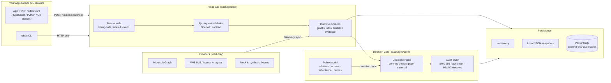
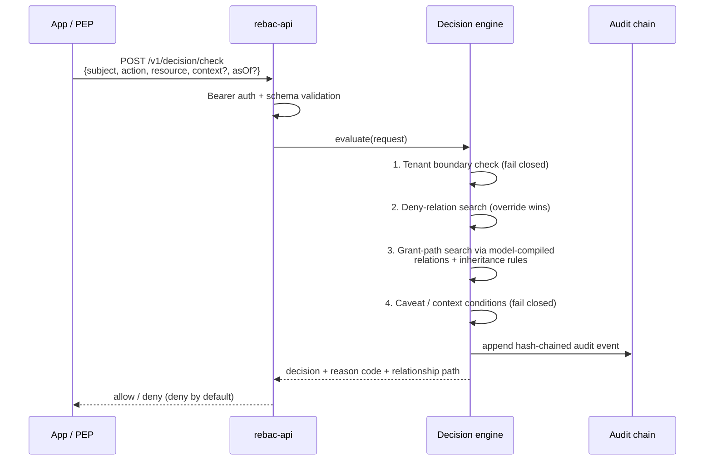
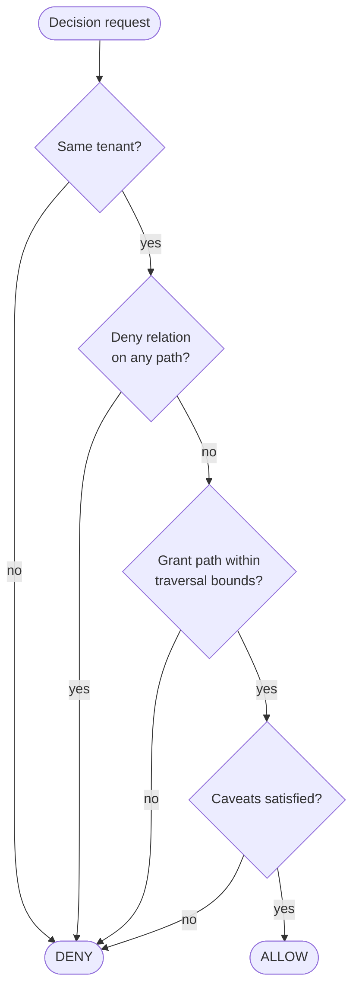
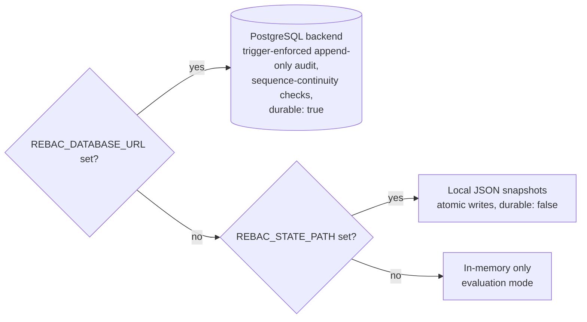

# Access Kit

[](https://github.com/pbroom/access-kit/actions/workflows/ci.yml)
[](https://github.com/pbroom/access-kit/actions/workflows/security.yml)
[](LICENSE)


**Access Kit is an API-first, CLI-first ReBAC (relationship-based access control) control plane foundation for ATO-ready access governance.**

It answers one question deterministically — *"may this subject perform this action on this resource?"* — by traversing a relationship graph compiled from an explicit policy model, with deny-by-default behavior, explainable decisions, a tamper-evident audit trail, and evidence packaging built for security assessors.

> **Honest status:** this repository is a local proof point. It validates contracts, runtime behavior, and evidence flows. It is not a production authorization service yet. Start with the [Product Positioning And Adoption Guide](docs/product-positioning-adoption-guide.md) to judge fit, non-goals, and readiness gaps.

## How It Fits Together



Three boundaries matter:

1. **Applications never evaluate authorization locally.** PEPs and the CLI call the HTTP API; the decision logic lives in one place.
2. **The policy model drives the engine.** Relations, action grants, inheritance rules, and deny rules are declared in a validated `PolicyModel` and compiled into the traversal — custom relations and actions work without engine changes.
3. **Provider connectors are read-only.** Microsoft Graph and AWS connectors discover existing access for reconciliation and drift detection; no live provider writes exist.

## What A Decision Looks Like



Every decision returns a stable reason code and, for `explain`, the exact relationship path that produced the result. If no grant path exists, bounds are exceeded, context is invalid, or a deny relation matches — the answer is deny.



## Quickstart

Use Node 22+ and pnpm 10.

```sh
corepack enable
pnpm install
pnpm validate        # contracts, policy fixtures, tests, conformance
```

Shortest runnable path — start the API with Docker Compose and run the seeded demo:

```sh
docker compose -f docker-compose.quickstart.yml up --build -d
pnpm quickstart:demo
```

The demo seeds a synthetic graph, calls `check` and `explain`, and shows both allow and deny-by-default results. See the [five-minute quickstart](docs/five-minute-quickstart.md).

For the full 30-minute evaluation (policy tests, dry-run provisioning, reconciliation, audit export, evidence export), keep the API running and:

```sh
pnpm evaluation:demo
```

See the [developer evaluation path](docs/developer-evaluation-path.md). For pre-submit confidence, `pnpm ci:check` runs the CI-equivalent gate (adds lint, build, and evidence freshness).

## Run The Local API

```sh
pnpm exec tsx packages/api/src/bin.ts
```

The API listens on `127.0.0.1:3000` by default.

| Variable | Default | Purpose |
| --- | --- | --- |
| `REBAC_API_HOST` | `127.0.0.1` | Bind host. Non-loopback hosts require bearer tokens. |
| `REBAC_API_PORT` | `3000` | Bind port. |
| `REBAC_API_ACTOR` | `service:api` | Default actor for service-emitted audit events when bearer tokens are unlabeled or auth is disabled on loopback. |
| `REBAC_API_KEYS` | unset | Comma-separated bearer tokens for `/v1` routes except health and readiness. Optional `label:token` entries record audit events as `api-key:<label>`. |
| `REBAC_STATE_PATH` | unset | Optional JSON runtime state snapshot path. Includes policy lifecycle state, restored on restart. |
| `REBAC_EVIDENCE_ROOT` | unset | Optional local persistence root for audit records and evidence packages. |
| `REBAC_DATABASE_URL` | unset | Optional PostgreSQL connection URL. When set, graph, connector-state, audit, and evidence persistence use the `@access-kit/persistence-postgres` backend instead of local files. |
| `REBAC_DATABASE_TENANT_BOUNDARY` | unset | Tenant boundary required by the PostgreSQL backend (for example `tenant:alpha`). Required with `REBAC_DATABASE_URL`. |
| `REBAC_DATABASE_AUDIT_SIGNING_KEY` | unset | Audit-window signing key material (32+ characters) for the PostgreSQL backend. Required with `REBAC_DATABASE_URL`. |

Public probes:

```sh
curl http://127.0.0.1:3000/v1/health
curl http://127.0.0.1:3000/v1/ready
```

When `REBAC_API_KEYS` is set, call protected routes with `Authorization: Bearer <token>`. Labeled tokens (`label:token`) attribute audit events to `api-key:<label>`; unlabeled tokens use `REBAC_API_ACTOR`. Because the first colon opts an entry into labeled parsing, rotate any existing opaque tokens containing `:` to colon-free values before upgrading. The runtime refuses to bind beyond loopback without keys, audits failed authentication attempts, and excludes token material from logs. Internal errors return generic bodies — details stay in server-side logs.

### Choosing a persistence backend



Persistence descriptors are honest: only the PostgreSQL backend reports `durable: true`, and only when actually connected. `/v1/ready` reports the backend in use.

## Run The CLI

Point the CLI at a running API with `--api-url` or `REBAC_API_URL`:

```sh
REBAC_API_URL=http://127.0.0.1:3000 pnpm exec tsx packages/cli/src/bin.ts check user:123 read document:case-plan
REBAC_API_URL=http://127.0.0.1:3000 pnpm exec tsx packages/cli/src/bin.ts explain user:123 read document:case-plan
REBAC_API_URL=http://127.0.0.1:3000 pnpm exec tsx packages/cli/src/bin.ts connector list
```

The CLI is an operator wrapper over the API contract. Authorization logic belongs in the API/core engine, not in the CLI.

## The Policy Model

Authorization semantics are declared, validated, and compiled — not hardcoded. A policy model names its relations (with kinds: `grant`, `membership`, `containment`, `deny`), maps actions to grant relations, scopes inheritance rules to actions, and declares override deny rules:

```jsonc
{
  "relations": [
    { "name": "member_of",  "kind": "membership",  "subjectTypes": ["user", "group"], "objectTypes": ["group"] },
    { "name": "contains",   "kind": "containment", "subjectTypes": ["workspace"],     "objectTypes": ["document"] },
    { "name": "auditor_of", "kind": "grant",       "subjectTypes": ["user"],          "objectTypes": ["dataset"] },
    { "name": "denied",     "kind": "deny",        "subjectTypes": ["user"],          "objectTypes": ["dataset"] }
  ],
  "actions": [{ "name": "audit", "grants": ["auditor_of"] }],
  "inheritanceRules": [
    { "name": "group-grants", "relation": "member_of", "through": "member_of", "actions": ["audit"] }
  ],
  "denyRules": [{ "name": "explicit-deny", "relation": "denied", "precedence": "override" }]
}
```

Undeclared relations grant nothing, deny rules always win, and every model change is validated for internal consistency before it can publish. See the [domain model](docs/domain-model.md) and [decision lifecycle](docs/decision-lifecycle.md).

## Assurance

The engine and API are covered by behavioral tests, property-based fuzzing, and contract gates:

- **~500 behavioral tests** across the engine, live HTTP API runtime, CLI-over-API, connectors, and PEP conformance.
- **Property-based fuzzing** (fast-check) over randomized graphs asserting deny-by-default, deny-override, deny monotonicity, tenant isolation, and determinism invariants.
- **Contract parity gates**: the OpenAPI spec, route registry, contract-snapshot client, and CLI command manifest are cross-validated in CI.
- **Benchmark regression gate** on decision-engine latency targets.
- **CI-exercised PostgreSQL integration tests** against a real `postgres:16` service container, plus a container smoke test that seeds data and asserts real allow and deny decisions.
- **Tamper-evident audit**: SHA-256 hash chains, HMAC-signed audit windows, Ed25519-signed evidence packages, and database-trigger-enforced append-only audit tables on the PostgreSQL backend.

Generate or check the proof-point validation report:

```sh
pnpm evidence:generate
pnpm evidence:check
```

The report lives at `reports/proof-point-validation.md`.

## What It Is Not

- Not an identity provider or authentication system.
- Not a SIEM, ticketing system, or generic workflow platform.
- Not an AWS IAM, Entra ID, Active Directory, SharePoint, Teams, or Power Platform replacement.
- Not a UI-first admin portal.
- It does not use an LLM to make authorization decisions.
- It does not claim a production ATO.

## Repository Map

| Path | Purpose |
| --- | --- |
| `packages/core/` | Domain types, policy model + compiler, decision engine, audit chain, repository contracts, reference adapters. |
| `packages/api/` | HTTP API runtime (`rebac-api`), auth, request validation, runtime modules, readiness checks. |
| `packages/persistence-postgres/` | PostgreSQL persistence backend with append-only audit tables. |
| `packages/api-contracts/` | OpenAPI contract snapshot and contract client exports. |
| `packages/typescript-client/` | TypeScript client and Express-style PEP helper. |
| `packages/cli/` | Operator CLI over the API contract. |
| `packages/connectors-aws/` | Read-only AWS access-analysis connector (IAM Identity Center, CloudTrail, Access Analyzer). |
| `packages/connectors-microsoft-graph/` | Read-only Microsoft Graph Entra connector. |
| `packages/connectors-mock/` | Mock and synthetic connectors implementing the adapter boundary. |
| `packages/connectors-sample-readonly/` | Copyable read-only connector template with contract tests. |
| `openapi/` | ReBAC control-plane OpenAPI contract. |
| `schemas/` | JSON Schemas for public domain contracts. |
| `docs/` | Concept of operations, architecture, domain, API/CLI references, security and threat models, ATO evidence, assessor guidance. |
| `runbooks/` | Emergency revocation, rollback, drift, outage, break-glass, and credential procedures. |
| `examples/` | API collections, CLI examples, TypeScript/Python/Go PEP starters, sample apps, sample policy repository. |
| `deploy/` | Reference Kubernetes manifests, overlays, persistence evidence, admission-policy examples. |
| `adrs/` | Architecture decision records. |
| `scripts/` | Validation, evidence-generation, steward, and stack-readiness commands. |
| `tests/` | Behavioral, property, conformance, and contract test suites. |
| `reports/` | Generated validation evidence. |

## Documentation

Start at [`docs/start-here.md`](docs/start-here.md). Suggested reading path:

1. [Concept of operations](docs/concept-of-operations.md) and [system context and boundary](docs/system-context-and-boundary.md) for operating scope.
2. [Domain model](docs/domain-model.md), [decision lifecycle](docs/decision-lifecycle.md), [explain API](docs/explain-api.md), and [PEP conformance](docs/pep-conformance.md) for authorization behavior.
3. [Provisioning lifecycle](docs/provisioning-lifecycle.md), [connector contract](docs/connector-contract.md), [connector authoring tutorial](docs/connector-authoring-tutorial.md), and [drift detection](docs/drift-detection-model.md) for operational change control.
4. [Audit event model](docs/audit-event-model.md), [evidence catalog](docs/evidence-catalog.md), [control traceability matrix](docs/control-traceability-matrix.md), and [assessor inspection guide](docs/assessor-inspection-guide.md) for inspection and evidence.
5. [Security model](docs/security-model.md), [threat model](docs/threat-model.md), and the runbooks before operating enforcement paths.

Other canonical sources: [API notes](docs/api.md) · [CLI contract](docs/cli.md) · [persistence](docs/persistence.md) · [production reference architecture](docs/production-reference-architecture.md) · [release packaging](docs/release-packaging.md) · [support policy](docs/support-policy.md) · [security policy](SECURITY.md) · [changelog](CHANGELOG.md) · [implementation backlog](docs/implementation-backlog.md) · [automation loop](docs/automation.md)

## Contributing And Automation

The repo runs a stacked-PR workflow with steward tooling:

```sh
pnpm pr:status       # PR steward dry run
pnpm backlog:next    # next implementation slice
pnpm stack:ready     # stack readiness preflight
pnpm security:pass   # audit + full CI-equivalent gate
pnpm pr:stack        # gt submit --stack
```

Run `pnpm pr:stack` from a clean worktree after preflighting mergeability against `origin/main`. See [`docs/automation.md`](docs/automation.md).

## License

[MIT](LICENSE)
