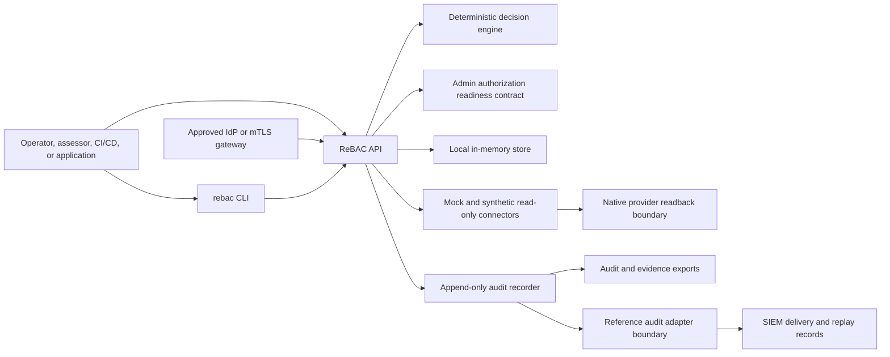

# System Context And Boundary

This page answers: what does the control plane own in the current local proof point, what must the deployment environment supply, and what crosses each trust boundary? It is not a production deployment diagram or an approved control statement.

## System Context

## Boundary Summary

| Area           | Inside current boundary                                                                                                                               | Outside current boundary                                                                                                       |
| -------------- | ----------------------------------------------------------------------------------------------------------------------------------------------------- | ------------------------------------------------------------------------------------------------------------------------------ |
| Authentication | Local bearer-token guardrails and an admin authorization descriptor/readiness contract.                                                               | Actual user authentication, MFA, PIV/CAC, federation, session management, gateway operation, and mTLS certificate lifecycle.   |
| Authorization  | Application ReBAC decisions, explanations, reason codes, policy and relationship versions; production requirements for a separate admin ReBAC policy. | Native provider enforcement internals, application-local checks, and deployed admin session enforcement.                       |
| Connectors     | Mock connector and synthetic read-only provider fixtures.                                                                                             | Live Entra ID, AD, SharePoint, Teams, Power Platform, Dataverse, AWS, and provider write APIs.                                 |
| Storage        | Local in-memory runtime, local file-backed proof-point receipts, and production-shaped graph, queue, and audit adapter boundaries.                    | Selected environment-specific databases, WORM or immutable-ledger driver, approved SIEM deployment, backup/restore operations. |
| Evidence       | Local ATO-oriented package shape and generated proof-point report.                                                                                    | Assessor-approved control statements, deployment diagrams, production scan artifacts.                                          |

## Trust Boundaries

| Boundary                     | Data crossing                                                                       | Required protection                                                                                              |
| ---------------------------- | ----------------------------------------------------------------------------------- | ---------------------------------------------------------------------------------------------------------------- |
| CLI to API                   | Operator commands, decision requests, provisioning requests, evidence requests.     | Authenticated API session in production, request validation, audit correlation.                                  |
| IdP or mTLS gateway to API   | Verified admin subject, groups, session metadata, or client-certificate identity.   | Trusted header provenance, MFA/session controls, certificate validation, revocation, and no secret-bearing logs. |
| Application to API           | Subject, action, resource, context.                                                 | Strong caller identity, least privilege, deterministic response handling.                                        |
| API to connector             | Discovery, readback, dry-run verification, synthetic enforcement requests.          | Connector capability checks, least privilege, idempotency, audit events.                                         |
| Connector to native platform | Observed native grants and inventory.                                               | Read-only scopes until live connector review is complete.                                                        |
| Audit to evidence            | Audit events, payload hashes, integrity reports, control mappings.                  | Append-only storage, hash-chain verification, retention, tamper evidence.                                        |
| Audit adapter to SIEM        | Signed audit windows, JSONL-ready source events, delivery receipts, replay records. | WORM retention, delivery monitoring, replay evidence, alert routing, and no secret-bearing payloads.             |

## Data Flows

1. Decision: caller submits subject, action, resource, optional context, policy version, and relationship version; the API applies deterministic policy logic over active relationship facts and records the decision. `explain` adds the relationship path and constraints used.
2. Provisioning: the API creates a plan and job evidence; dry-run skips provider writes. Example: `rebac provision revoke grant:case-plan-read --connector mock` creates a plan with a revoke action, performs no native write, records expected readback, and emits an audit event.
3. Discovery and reconciliation: connector sync reads inventory and native grants into discovery records; native grants are compared to intended access and produce drift findings. The optional Microsoft Graph connector reads a sandbox tenant only when explicitly configured and stores redacted identifiers.
4. Audit and evidence: events are hash chained, exported, mapped to controls, retained through immutable adapter receipts when configured, and tied to SIEM delivery or replay records when a forwarder is used.
5. Admin readiness: the runtime reports whether local bearer-token proof points have been replaced by an evidenced IdP or mTLS gateway, separate admin ReBAC policy, secrets-manager references, break-glass approval, incident notifications, and post-action review evidence.

## Rules For Boundary Evidence

- Boundary documents must not include real tenant IDs, account IDs, emails, tokens, secrets, production hostnames, or sensitive resource names. Microsoft Graph sandbox evidence must stay redacted.
- The evidence export schema ([schemas/evidence-export.schema.json](../schemas/evidence-export.schema.json)) carries `systemBoundary` and `dataFlows` sections; in the local proof point they are synthetic contract evidence. Deployment-specific diagrams and reviewer-approved statements must replace them before production assessment.
- Live connector credentials require managed identity or vault-backed secret handling with documented rotation. Native platforms remain enforcement points where applicable.

## Related References

- [Architecture](architecture.md)
- [Security Model](security-model.md)
- [ATO Evidence Model](ato-evidence-model.md)
- [ADR 0006: Connector plugin architecture](../adrs/0006-connector-plugin-architecture.md)
- [ADR 0008: Evidence export control mapping](../adrs/0008-evidence-export-control-mapping.md)
