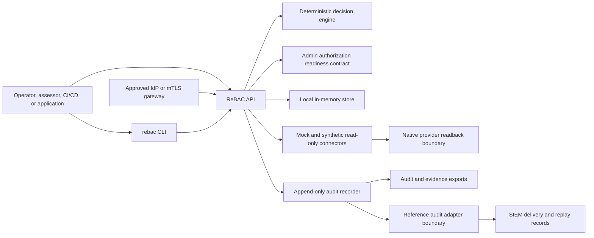

# System Context And Boundary

## Purpose

This page defines the Access Kit system boundary, external dependencies, trust boundaries, and data flows for implementers and assessors.

## Audience

Platform engineers, security engineers, ISSOs, assessors, architects, and governance leads.

## What This Is

The boundary describes what the ReBAC control plane owns in the current local proof point and what must be supplied by deployment environments in later phases.

## What This Is Not

This is not a production deployment diagram, FedRAMP boundary authorization, live tenant data-flow inventory, or approved control statement.

## System Context

## Boundary Summary

| Area | Inside current boundary | Outside current boundary |
| --- | --- | --- |
| Authentication | Local bearer-token guardrails and an admin authorization descriptor/readiness contract. | Actual user authentication, MFA, PIV/CAC, federation, session management, gateway operation, and mTLS certificate lifecycle. |
| Authorization | Application ReBAC decisions, explanations, reason codes, policy and relationship versions; production requirements for a separate admin ReBAC policy. | Native provider enforcement internals, application-local checks, and deployed admin session enforcement. |
| Connectors | Mock connector and synthetic read-only provider fixtures. | Live Entra ID, AD, SharePoint, Teams, Power Platform, Dataverse, AWS, and provider write APIs. |
| Storage | Local in-memory runtime, local file-backed proof-point receipts, and production-shaped graph, queue, and audit adapter boundaries. | Selected environment-specific databases, WORM or immutable-ledger driver, approved SIEM deployment, backup/restore operations. |
| Evidence | Local ATO-oriented package shape and generated proof-point report. | Assessor-approved control statements, deployment diagrams, production scan artifacts. |

## Trust Boundaries

| Boundary | Data crossing | Required protection |
| --- | --- | --- |
| CLI to API | Operator commands, decision requests, provisioning requests, evidence requests. | Authenticated API session in production, request validation, audit correlation. |
| IdP or mTLS gateway to API | Verified admin subject, groups, session metadata, or client-certificate identity. | Trusted header provenance, MFA/session controls, certificate validation, revocation, and no secret-bearing logs. |
| Application to API | Subject, action, resource, context. | Strong caller identity, least privilege, deterministic response handling. |
| API to connector | Discovery, readback, dry-run verification, synthetic enforcement requests. | Connector capability checks, least privilege, idempotency, audit events. |
| Connector to native platform | Observed native grants and inventory. | Read-only scopes until live connector review is complete. |
| Audit to evidence | Audit events, payload hashes, integrity reports, control mappings. | Append-only storage, hash-chain verification, retention, tamper evidence. |
| Audit adapter to SIEM | Signed audit windows, JSONL-ready source events, delivery receipts, replay records. | WORM retention, delivery monitoring, replay evidence, alert routing, and no secret-bearing payloads. |

## Data Flows

1. Decision request: caller submits subject, action, resource, optional context, policy version, and relationship version.
2. Evaluation: API loads canonical subject, resource, and active relationship facts, applies deterministic policy logic, and records the decision.
3. Explanation: `explain` includes the relationship path and constraints used for review.
4. Provisioning: API creates a plan and job evidence; dry-run skips provider writes.
5. Discovery: connector sync reads synthetic inventory and native grants into discovery and native-grant records; the optional Microsoft Graph connector can read a sandbox tenant only when explicitly configured and stores redacted Entra, M365/Teams, SharePoint, and OneDrive identifiers.
6. Reconciliation: native grants are compared to intended access and produce drift findings.
7. Audit and evidence: events are hash chained, exported, mapped to controls, retained through immutable adapter receipts when configured, and tied to SIEM delivery or replay records when a forwarder is used.
8. Admin authorization readiness: the runtime reports whether local bearer-token proof points have been replaced by an evidenced IdP or mTLS gateway, separate admin ReBAC policy, secrets-manager references, break-glass approval, incident notifications, and post-action review evidence.

## Concrete Example

For a dry-run revocation, an operator calls `rebac provision revoke grant:case-plan-read --connector mock`. The CLI calls the API, the API creates a plan with a revoke action, no native provider write occurs, verification records expected readback, and an audit event captures the planned revocation.

## Security Considerations

- Boundary documents must not include real tenant IDs, account IDs, emails, tokens, secrets, production hostnames, or sensitive resource names.
- Deployment-specific diagrams must replace this local proof-point boundary before production assessment.
- Production admin diagrams must show the IdP or mTLS gateway, trusted identity headers or certificate claims, admin ReBAC policy boundary, secrets manager, session revocation path, break-glass approval path, notification targets, and post-action review evidence store.
- Live connector credentials require managed identity or vault-backed secret handling and documented rotation.
- Microsoft Graph sandbox evidence must retain redacted run artifacts and must not contain raw tenant IDs, object IDs, user principal names, bearer tokens, request IDs, or raw Graph pagination cursors.
- Native platforms remain enforcement points where applicable.

## Audit And Evidence Implications

The evidence export schema contains `systemBoundary` and `dataFlows` sections. In the local proof point, those sections are synthetic and should be treated as contract evidence. Production packages must include deployment-specific boundary evidence and reviewer-approved statements.

## Related Controls

AC, AU, CM, CA, SC, IA, IR, SA, and SR control families all rely on a clear boundary.

## Related References

- [Architecture](architecture.md)
- [ATO Evidence Model](ato-evidence-model.md)
- [Security Model](security-model.md)
- [Evidence Catalog](evidence-catalog.md)
- `schemas/evidence-export.schema.json`
- [ADR 0006: Connector plugin architecture](../adrs/0006-connector-plugin-architecture.md)
- [ADR 0008: Evidence export control mapping](../adrs/0008-evidence-export-control-mapping.md)
