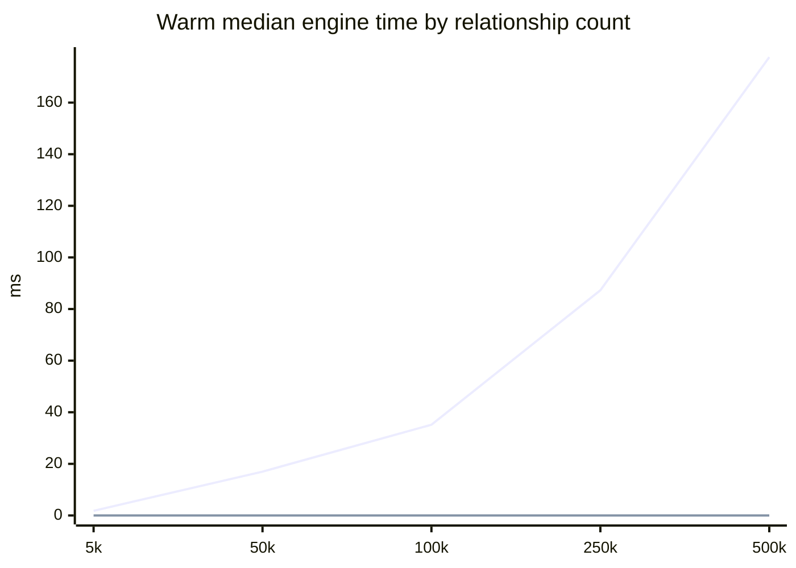
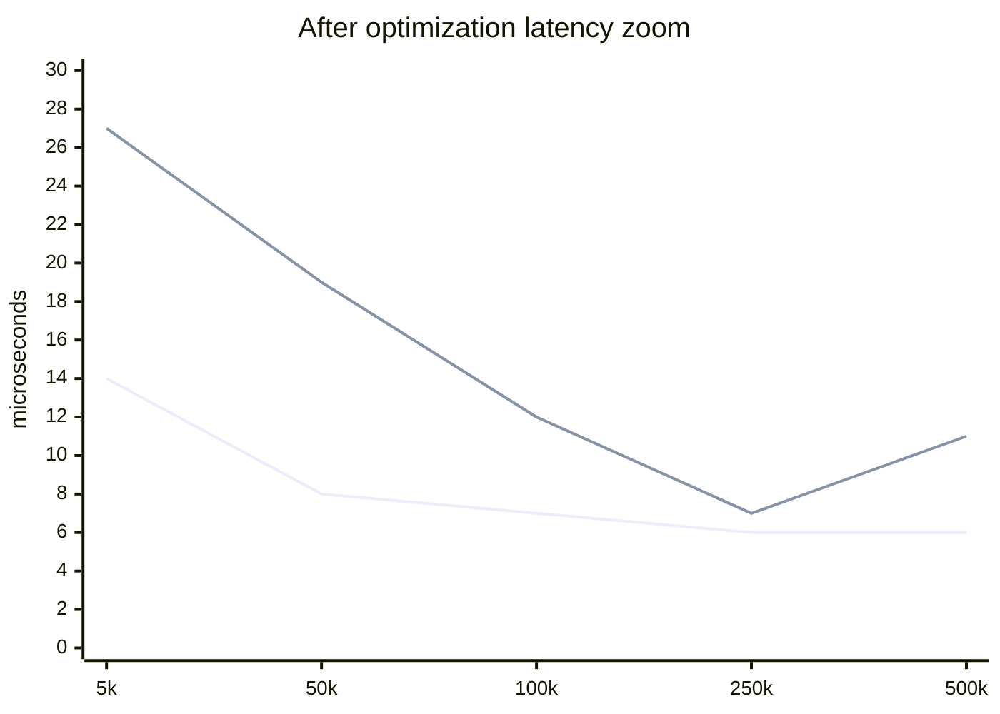
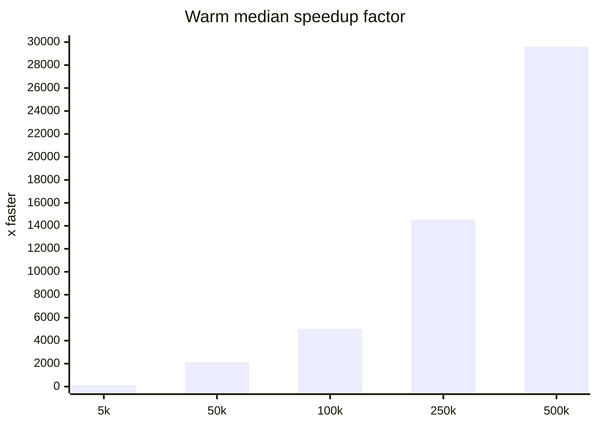

# Decision Engine Benchmark

This report compares the original TypeScript decision traversal against the optimized TypeScript traversal on a synthetic graph with a short reachable allow path and many unrelated relationships.

- Iterations per size: 31 (first run is cold, remaining runs feed the warm median and p95).
- Scenario: `user:runtime-subject -> group:0 -> document:runtime-target`, plus filler `viewer_of` relationships distributed across unrelated groups and documents.
- Baseline source: pre-optimization run on `origin/main` before this branch changed the engine/store hot path.

## Warm Median Engine Time

## Results

| Relationships | Before warm median engine ms | After warm median engine ms | Speedup | Before p95 engine ms | After p95 engine ms |
| ---: | ---: | ---: | ---: | ---: | ---: |
| 5,000 | 1.792 | 0.014 | 128x | 2.190 | 0.027 |
| 50,000 | 16.984 | 0.008 | 2123x | 17.885 | 0.019 |
| 100,000 | 35.153 | 0.007 | 5022x | 38.276 | 0.012 |
| 250,000 | 87.258 | 0.006 | 14543x | 95.803 | 0.007 |
| 500,000 | 177.591 | 0.006 | 29599x | 184.394 | 0.011 |

## Visual Scale

The headline chart uses the baseline scale, which makes the optimized line hug zero. These zoomed views avoid font-dependent text bars and make the post-optimization values readable.

## Notes

- The benchmark is intentionally shaped to expose the previous global relationship filtering/indexing cost. It is not a worst-case graph-explosion traversal.
- The optimized engine lazily filters active relationships per visited subject and caches that subject index by relationship revision, `asOf`, and tuple-version scope.
- The store now keeps relationship adjacency by subject, so unrelated graph size no longer dominates decisions with a short reachable path.

